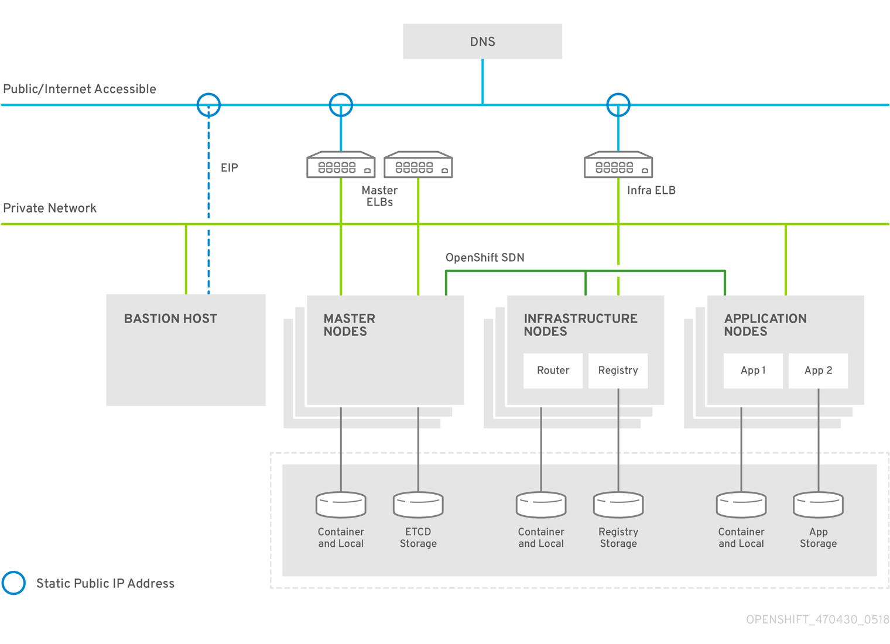

Started getting AWS architecture deployed after some planning based on the diagram below. 
Currently provisions: 1 Bastion Host, 1 Master node, 2 Infra nodes, 3 Worker nodes

Provides a 100% working 3.11 origin cluster in AWS.

Requirements -  

- terraform <=11.11 download at terraform.io, and run from git-bash or bash in the top level working directory of this repo
- edit variables file (00-aws-variables.tf)
- replace all instances of "<SUBDOMAIN>" with your subdomain in the hosts.inventory file

Notes:

- You need to manually run the prerequisites.yml and deploy_cluster.yml on the bastion host
- All 05-sysaws-instance.tf files contain one full declaration of a node, defining the instance itself, the disks, and the DNS name. This makes it easy to add more worker nodes later.

....

